# Wood-ARK 执行流程图

本文档展示从启动到推送的完整执行链路。

## 🔄 完整执行流程

```mermaid
flowchart TD
    Start([⏰ 每天 19:00<br/>Launchd 触发]) --> CheckDay{是否工作日?}
    
    CheckDay -->|否-周末| Skip1[❌ 跳过执行<br/>记录日志]
    CheckDay -->|是-周一至周五| CheckDup{今天已推送?}
    
    CheckDup -->|是| Skip2[❌ 跳过执行<br/>防止重复]
    CheckDup -->|否| Init[📦 初始化模块<br/>fetcher/analyzer/reporter等]
    
    Init --> Loop1[🔄 遍历 5 个 ETF<br/>ARKK, ARKW, ARKG, ARKQ, ARKF]
    
    Loop1 --> Fetch[📡 步骤1: 获取数据<br/>DataFetcher.fetch_holdings]
    
    Fetch --> API1{数据源选择}
    API1 -->|主数据源| ARKFunds[🌐 ARKFunds.io API<br/>真实API请求]
    API1 -->|失败| Retry[🔄 重试3次<br/>间隔1s, 2s, 4s]
    
    ARKFunds --> JSON[📄 返回JSON数据]
    JSON --> Transform[🔄 转换为DataFrame]
    
    Transform --> Validate{数据验证}
    Validate -->|成功| SaveCSV[💾 保存到本地<br/>data/holdings/ARKK/2025-11-14.csv]
    Validate -->|失败| Error1[❌ 记录错误<br/>继续下一个ETF]
    
    SaveCSV --> LoadPrev[📂 加载昨日数据<br/>2025-11-13.csv]
    
    LoadPrev --> Analyze[📊 步骤2: 分析变化<br/>Analyzer.compare_holdings]
    
    Analyze --> CalcDiff[🔢 计算差异<br/>新增/移除/增持/减持]
    
    CalcDiff --> GenReport[📝 步骤3: 生成报告<br/>ReportGenerator.generate_markdown]
    
    GenReport --> GenImage[🖼️ 步骤4: 生成长图<br/>ImageGenerator.generate_comprehensive_report_image]
    
    GenImage --> ImageParts[拼接图表<br/>📊 持仓表格<br/>📈 市值趋势<br/>📉 Top10趋势]
    
    ImageParts --> SaveData[💾 保存到汇总字典<br/>all_current_holdings<br/>all_analysis_results<br/>all_etf_images]
    
    SaveData --> NextETF{还有ETF?}
    NextETF -->|是| Loop1
    NextETF -->|否| CheckCount{成功≥2个?}
    
    CheckCount -->|否| Skip3[⚠️ 跳过推送<br/>成功数量不足]
    CheckCount -->|是| Summary[📊 生成汇总分析<br/>SummaryAnalyzer]
    
    Summary --> Cross[🔍 跨基金重叠分析<br/>独家持仓检测<br/>重点变化提取]
    
    Cross --> Push1[📤 推送1/7: 超长文字<br/>汇总+5个基金摘要]
    
    Push1 --> Wait1[⏱️ 等待0.5秒]
    
    Wait1 --> Push2[📤 推送2/7: 汇总长图<br/>generate_summary_report_image]
    
    Push2 --> Wait2[⏱️ 等待0.5秒]
    
    Wait2 --> Push3[📤 推送3/7: ARKK长图]
    Push3 --> Wait3[⏱️ 等待0.5秒]
    
    Wait3 --> Push4[📤 推送4/7: ARKW长图]
    Push4 --> Wait4[⏱️ 等待0.5秒]
    
    Wait4 --> Push5[📤 推送5/7: ARKG长图]
    Push5 --> Wait5[⏱️ 等待0.5秒]
    
    Wait5 --> Push6[📤 推送6/7: ARKQ长图]
    Push6 --> Wait6[⏱️ 等待0.5秒]
    
    Wait6 --> Push7[📤 推送7/7: ARKF长图]
    
    Push7 --> MarkStatus[✅ 标记推送状态<br/>写入 push_status.json]
    
    MarkStatus --> End([🎉 任务完成<br/>记录日志])
    
    Skip1 --> End
    Skip2 --> End
    Skip3 --> End
    Error1 --> End
    
    style Start fill:#e1f5e1
    style ARKFunds fill:#fff3cd
    style JSON fill:#cfe2ff
    style Push1 fill:#f8d7da
    style Push2 fill:#f8d7da
    style Push7 fill:#f8d7da
    style End fill:#d1ecf1
```



---

## 🎯 关键步骤说明

### 1. 定时触发（Launchd）
- **时间**：每天 19:00（北京时间）
- **方式**：macOS Launchd（`~/Library/LaunchAgents/com.lucian.wood-ark.plist`）
- **日志**：`logs/launchd.log`

### 2. 工作日检查
- **逻辑**：周一至周五执行，周末跳过
- **可绕过**：使用 `--manual` 参数强制执行

### 3. 数据获取（真实API）
- **数据源**：ARKFunds.io API
- **URL 格式**：`https://arkfunds.io/api/v1/etf/holdings?symbol=ARKK`
- **数据新鲜度**：每日更新（美东时间 19:00）
- **重试机制**：失败后重试3次，间隔 1s, 2s, 4s

### 4. 数据验证
- ✅ 必需列检查：ticker, shares, weight
- ✅ 数据类型转换：shares → int, weight → float
- ✅ 缺失值处理：ticker 为空则抛出异常

### 5. 变化分析
- **对比逻辑**：merge 当前和昨日数据
- **识别类型**：新增、移除、增持（≥5%）、减持（≥5%）
- **计算公式**：`变化% = (今日股数 - 昨日股数) / 昨日股数 × 100`

### 6. 报告生成
- **Markdown 报告**：保存到 `data/reports/`
- **长图报告**：包含持仓表格、市值趋势、Top 10 趋势
- **图片格式**：PNG，保存到 `data/images/`

### 7. 分批推送（7条消息）
- **消息1**：超长文字（汇总 + 5个基金摘要）
- **消息2**：汇总长图
- **消息3-7**：5个单基金长图（ARKK, ARKW, ARKG, ARKQ, ARKF）
- **间隔**：每条消息间隔 0.5 秒（避免频率限制）

### 8. 状态标记
- **文件**：`data/cache/push_status.json`
- **作用**：防止同一天重复推送

---

## 🔍 数据流转路径

```
ARK Invest 官方数据
    ↓ (每日美东 19:00 更新)
ARKFunds.io 后端抓取
    ↓ (实时同步)
ARKFunds.io API (JSON)
    ↓ (你的脚本 19:00 请求)
本地 CSV 文件 (data/holdings/)
    ↓ (对比分析)
Markdown 报告 + 长图
    ↓ (企业微信 Webhook)
企业微信群消息
```

**时间差**：约 12 小时（北京时间 19:00 获取的是当天美东 19:00 的数据）

---

## 📋 执行模式对比

| 模式 | 命令 | 工作日检查 | 重复推送检查 |
|------|------|----------|------------|
| **自动模式** | Launchd 定时 | ✅ 检查 | ✅ 检查 |
| **手动模式** | `--manual` | ❌ 跳过 | ❌ 跳过 |
| **指定日期** | `--date 2025-01-15` | ❌ 跳过 | ❌ 跳过 |
| **指定ETF** | `--etf ARKK` | ✅ 检查 | ✅ 检查 |

---

## ✅ 数据真实性保证

### 数据源可靠性

| 数据源 | 可靠性 | 数据新鲜度 | 是否官方 |
|--------|--------|----------|---------|
| **ARKFunds.io API** | ⭐⭐⭐⭐⭐ | 每日更新 | ✅ 来自ARK官方 |
| GitHub 历史仓库 | ⭐⭐⭐ | 已停更（2021-09） | ❌ 第三方 |
| ARK 官网直链 | ⭐⭐⭐⭐ | 每日更新 | ✅ 官方（有反爬虫） |

**当前使用**：ARKFunds.io API（主数据源，真实可靠）

### 数据验证机制

```python
# ✅ 验证1：必需列检查
required_columns = ['ticker', 'shares', 'weight']

# ✅ 验证2：数据类型检查
df['shares'] = pd.to_numeric(df['shares'], errors='coerce')
df['weight'] = pd.to_numeric(df['weight'], errors='coerce')

# ✅ 验证3：缺失值处理
if df['ticker'].isna().any():
    raise ValueError("ticker列包含缺失值")

# ✅ 验证4：日期一致性检查
if df['date'].nunique() > 1:
    raise ValueError("数据包含多个日期")
```

---

## 🛠️ 故障处理

### 单个 ETF 失败
- **策略**：部分失败继续（Partial Success）
- **行为**：记录错误日志，继续处理其他 ETF
- **推送**：只要成功 ≥2 个基金就推送

### 网络请求失败
- **重试机制**：3次重试，指数退避（1s, 2s, 4s）
- **超时设置**：30秒
- **失败处理**：记录错误，继续下一个 ETF

### 推送失败
- **保存报告**：本地保存 Markdown 和长图
- **错误告警**：如果启用，发送错误通知到企业微信
- **状态标记**：标记为 failed，可手动重试

---

## 📞 常用命令

```bash
# 手动触发（忽略工作日检查）
python main.py --manual

# 指定日期
python main.py --date 2025-11-14 --manual

# 只处理单个 ETF
python main.py --etf ARKK --manual

# 测试 Webhook
python main.py --test-webhook

# 检查缺失数据
python main.py --check-missed

# 补充历史数据
python main.py --backfill --days 90

# 查看 Launchd 日志
tail -f logs/launchd.log
```

---

**最后更新**：2025-11-14  
**版本**：v2.0.0
